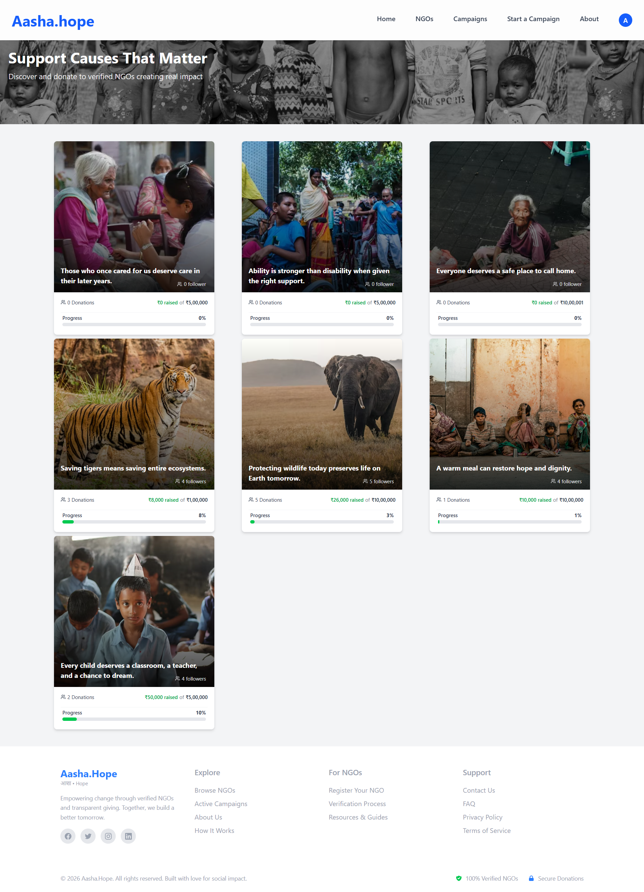
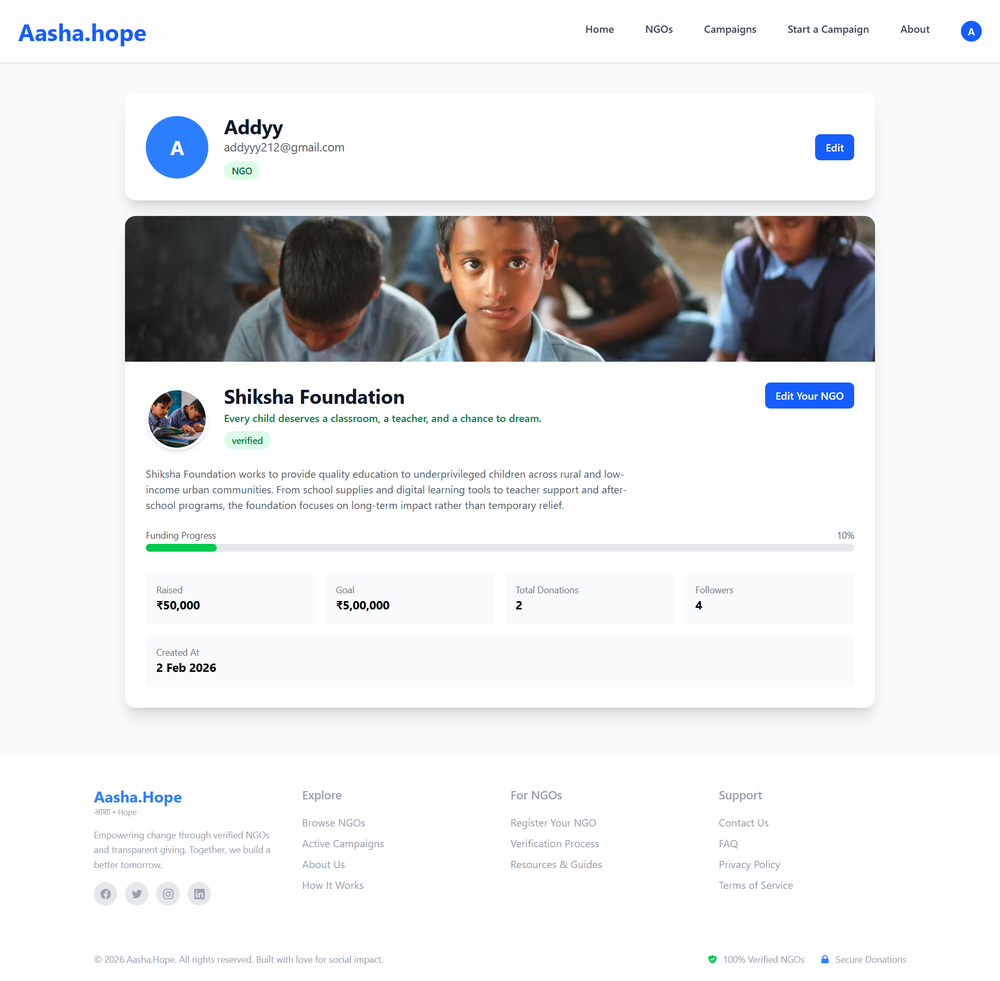
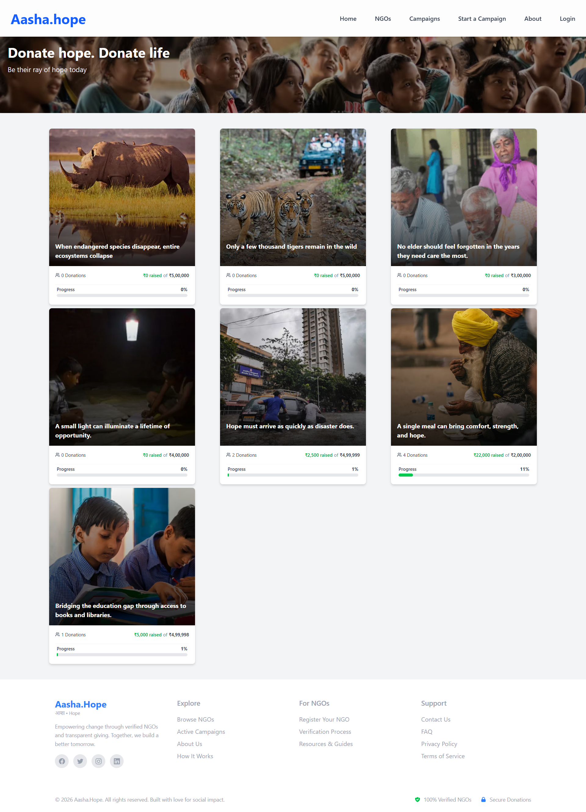
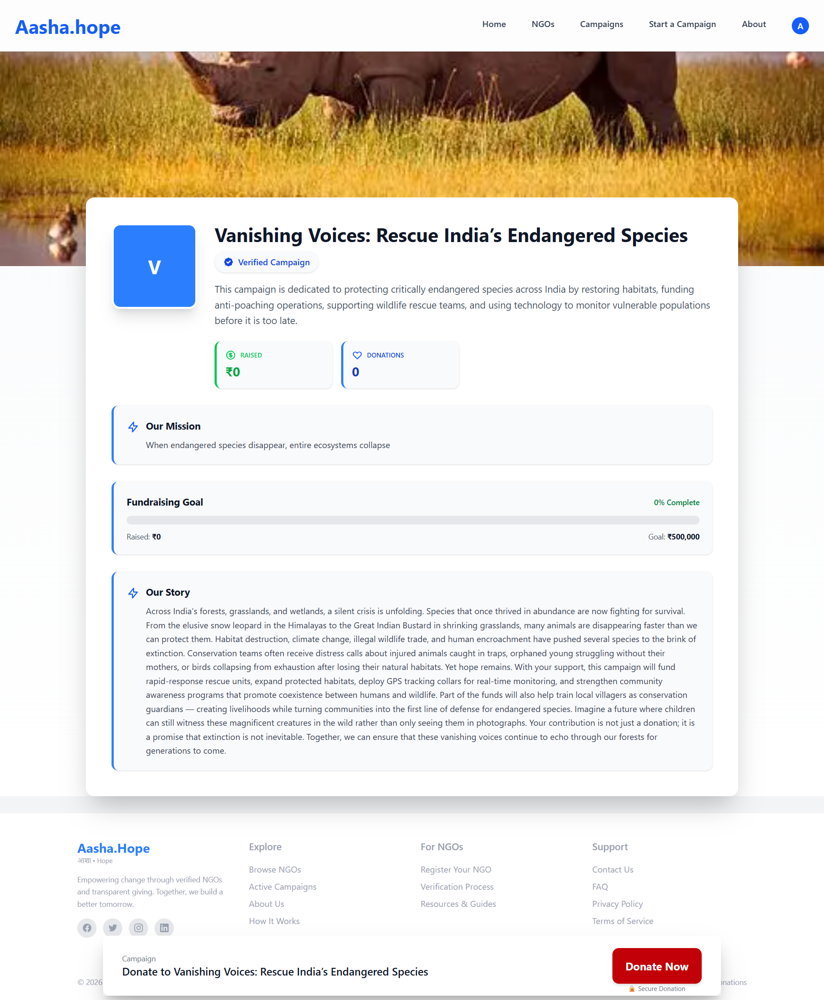
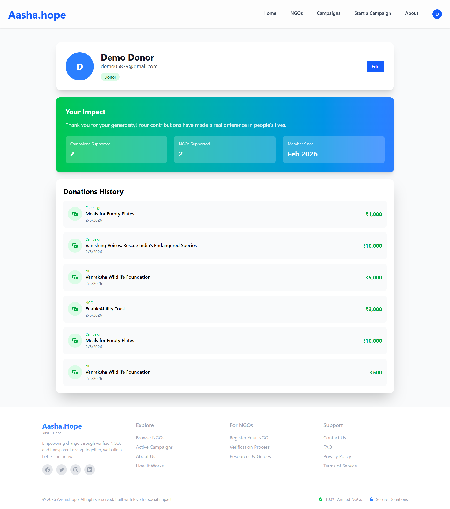
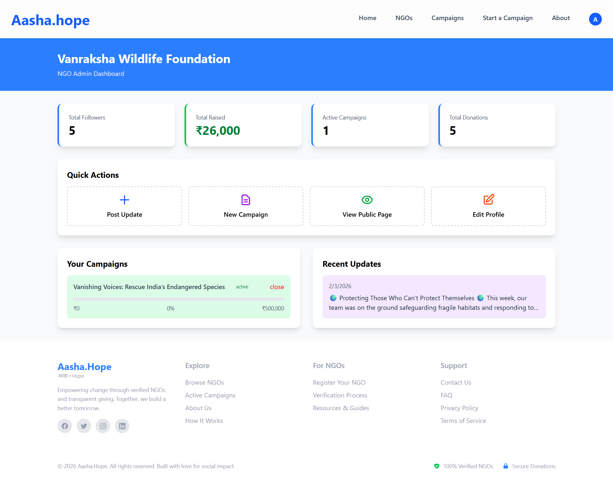

# 🌱 Aasha.Hope — Trust-Based Crowdfunding & Social Donation Platform

Aasha.Hope is a full-stack crowdfunding platform that enables NGOs and individuals to raise funds transparently, while helping donors stay emotionally connected to the causes they support.

Unlike traditional donation platforms that end at a payment confirmation, Aasha.Hope introduces a social transparency layer that allows donors to follow NGOs, view regular updates, and see real-world impact after donating — encouraging trust, community, and long-term donor retention.


## 🚀 Overview

Aasha.Hope is built around a simple but powerful idea:

 **Donors are more likely to donate again when they feel connected to the impact of their contribution.**

The platform separates long-term organizational identity from purpose-driven fundraising, while adding social engagement to close the emotional gap between donors and beneficiaries.

### The ecosystem includes:

- NGOs with verified public profiles and long-term fundraising goals  
- Campaigns as goal-based, time-bound fundraisers  
- Individuals raising funds for personal or emergency causes  
- Donors who follow NGOs, donate securely, and track impact through updates  

## 🔗 Live Demo
👉 https://aasha-hope-dq8w.vercel.app

## 📸 Screenshots

### Home & Discover


### NGO Listing Page


### NGO Page


### NGO Profile


### Campaign Listing Page


### Campaign Page


### Donor Dashboard & Updates


### Donor Profile


### NGO Dashboard & Updates


### Admin Dashboard 


## ⭐ Core Features

### 🔐 Authentication & Role-Based Access

- Secure login and signup  
- Role-specific dashboards:
  - Donor  
  - NGO 
  - Admin  
- Protected routes and access control  


### 🏢 NGO Profiles

- Verified public NGO profiles  
- Represent long-term mission and credibility  
- NGOs can define annual fundraising goals  
- NGOs can launch multiple campaigns over time  
- NGOs can post updates about ongoing work  
- Real-time progress tracking (amount raised vs goal)  


### 🎯 Campaign System

- Goal-based fundraising with clear targets  
- Real-time progress tracking (amount raised vs goal)  
- Campaign lifecycle states (pending, active, completed)  

**Campaigns can be created by:**

- NGOs (for specific initiatives)  
- Individuals (for medical, education, emergency causes)  


### 💳 Secure Donations

- Razorpay payment integration (test mode)  
- One-time donations  
- Automatic update of campaign progress  
- Donation history for donors  


### 🤝 Follow System (Social Layer)

- Donors can follow NGOs they care about  
- Following creates a long-term connection beyond a single donation  
- Followed NGOs appear in the donor’s personalized dashboard  


### 📰 Updates & Transparency (Core Innovation)

NGOs can post regular updates about:

- Work in progress  
- On-ground activities  
- Real-life impact of donations  

**Updates are visible on:**

- NGO profile pages  
- Donor dashboards (“Updates from NGOs you follow”)  

This feature transforms donations from a one-time transaction into an ongoing relationship.

By seeing how their money is used, donors:

- Feel included as part of a community  
- Gain confidence and trust in the organization  
- Experience emotional reinforcement  
- Are more likely to donate again (donor retention)  


### 🛡️ Admin Verification & Moderation

- Admin dashboard for platform oversight  
- Approval workflows for:
  - NGOs  
  - Campaigns  
- Reduces misuse and improves trust  
- Ensures only verified entities raise funds  


## 🧠 Product & System Design Highlights

- Clear separation between:
  - **NGOs →** long-term organizational identity  
  - **Campaigns →** specific fundraising objectives  
- Social features designed to improve donor engagement and retention  
- Verification-first architecture to build trust  
- Role-based authorization and moderation  
- Production-style database modeling and access control  

> **Aasha.Hope is not just about collecting donations —  
it is about building a transparent, trust-driven fundraising community.**


## 🛠 Tech Stack

### Frontend
- Next.js (App Router)  
- React  
- Tailwind CSS (pure Tailwind, no component libraries)  

### Backend
- Next.js Server Actions  
- Supabase (PostgreSQL)  

### Authentication & Security
- Supabase Auth  
- Row-Level Security (RLS)  

### Payments
- Razorpay (test mode)  

### Deployment
- Vercel  

## 🚀 Key Technical Highlights

- Built a full-stack production-style application using Next.js App Router
- Designed a role-based authorization system (Donor, NGO, Admin)
- Implemented secure payments with Razorpay
- Modeled relational data using PostgreSQL with Row Level Security
- Developed a social follow + updates system to improve donor retention
- Created admin verification workflows to prevent platform misuse

## 🔮 Future Enhancements

- Monthly recurring donations (subscriptions)  
- Notifications for new updates  
- Comments and reactions on updates  
- Enhanced verification for personal fundraisers 

## ⚙️ Local Setup

Follow these steps to run the project locally:

1. Clone the repository
```bash
git clone https://github.com/akankshaaddagatla/Aasha.hope.git
cd Aasha.hope
npm install

2. Setup environment variables
Create a .env.local file in the root directory and add:
  NEXT_PUBLIC_SUPABASE_URL=your_supabase_url
  NEXT_PUBLIC_SUPABASE_ANON_KEY=your_supabase_key
  RAZORPAY_KEY_ID=your_key
  RAZORPAY_SECRET=your_secret

3. Run the development server
  npm run dev


