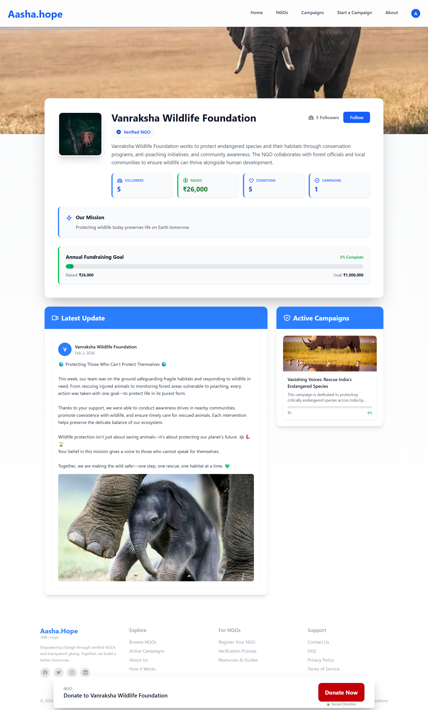
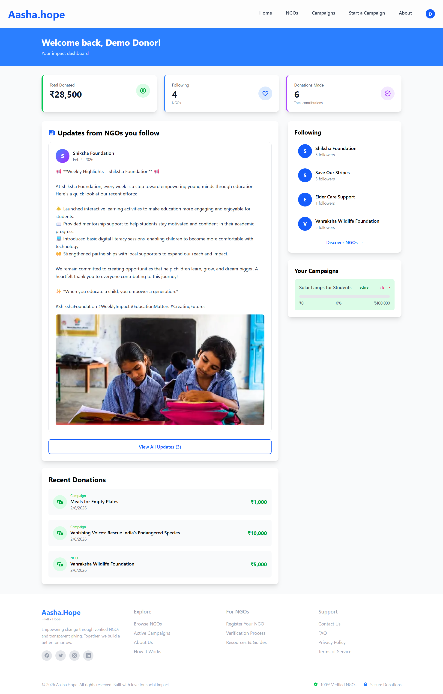
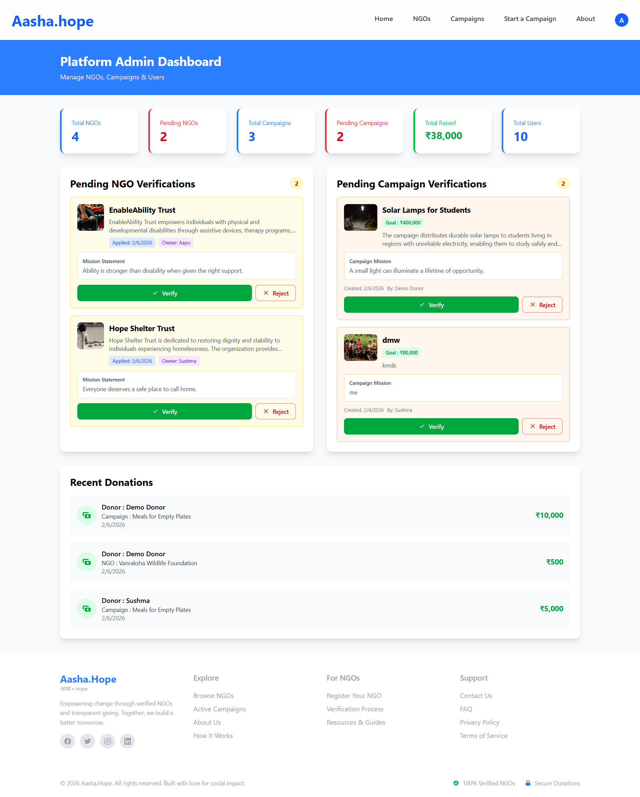

# 🌱 Aasha.Hope — Trust-Based Crowdfunding & Social Donation Platform

A trust-first crowdfunding platform that combines transparent fundraising with social engagement to improve donor retention.

Unlike traditional donation platforms that end at payment confirmation, Aasha.Hope introduces a **social transparency layer** where donors can follow NGOs, see updates, and see the real-world impact of their contributions — fostering trust, community, and long-term engagement.

## 🔗 Live Demo
👉 https://aasha-hope-seven.vercel.app/

## ✨ Key Features

### 🔐 Authentication & Role-Based Access
- Secure login and signup  
- Role-specific dashboards:
  - Donor  
  - NGO 
  - Admin 


### 🏢 NGO Profiles
- Verified public NGO profiles  
- Represent the organization’s long-term mission and credibility  
- NGOs can define annual fundraising goals and launch multiple campaigns.   
- NGOs can post updates about ongoing work.  
- Real-time progress tracking (amount raised vs goal)  


### 🎯 Campaign System

- Goal-based fundraising with clear targets  
- Real-time progress tracking (amount raised vs goal)  
- Campaign lifecycle states (pending, active, completed, closed)  

**Campaigns can be created by:**
- NGOs (for specific initiatives)  
- Individuals (for medical, education, emergency causes)  


### 💳 Secure Donations

- Razorpay payment integration (test mode)  
- One-time donations  


### 🤝 Follow System (Social Layer)

- Donors can follow NGOs they care about and look at the updates posted by NGOs.  
- Followed NGOs appear in the donor’s personalized dashboard  


### 📰 Updates & Transparency (Core Innovation)

NGOs can share:
- Work in progress  
- On-ground activities  
- Real-life impact of donations  

Updates appear on:
- NGO profile pages  
- Donor dashboards
  
This transforms donations from a one-time transaction into an ongoing relationship — increasing donor confidence and long-term retention.


### 🛡️ Admin Verification & Moderation

- Admin dashboard for platform oversight  
- Approval workflows for:
  - NGOs  
  - Campaigns

## 🧠 Design Decisions

- Clear separation between:
  - **NGOs →** long-term organizational identity  
  - **Campaigns →** specific fundraising objectives  
- Social features designed to improve donor engagement and retention  
- Verification-first architecture to build trust  
- Role-based authorization and moderation

  
## 🛠 Tech Stack

### Frontend
- Next.js (App Router)  
- React  
- Tailwind CSS 

### Backend
- Next.js Server Actions  
- Supabase (PostgreSQL)  

### Authentication & Security
- Supabase Auth  
- Row-Level Security (RLS)  

### Payments
- Razorpay (test mode)  

### Deployment
- Vercel  


## ⚙️ Local Setup
Follow these steps to run the project locally:

### 1. Clone the repository
```bash
git clone https://github.com/akankshaaddagatla/Aasha.hope.git
cd Aasha.hope
npm install
```

### 2. Setup environment variables
Create a `.env.local` file:

```env
NEXT_PUBLIC_SUPABASE_URL=your_supabase_url
NEXT_PUBLIC_SUPABASE_ANON_KEY=your_supabase_key
RAZORPAY_KEY_ID=your_key
RAZORPAY_SECRET=your_secret
```

### 3. Run the development server
```bash
npm run dev
```


## 🖼 Screenshots

| Home Page | NGO Page |
|---------|------------|
|  |  |

| Donor Dashboard | Admin Dashboard |
|---------------|--------------|
|  |  |

